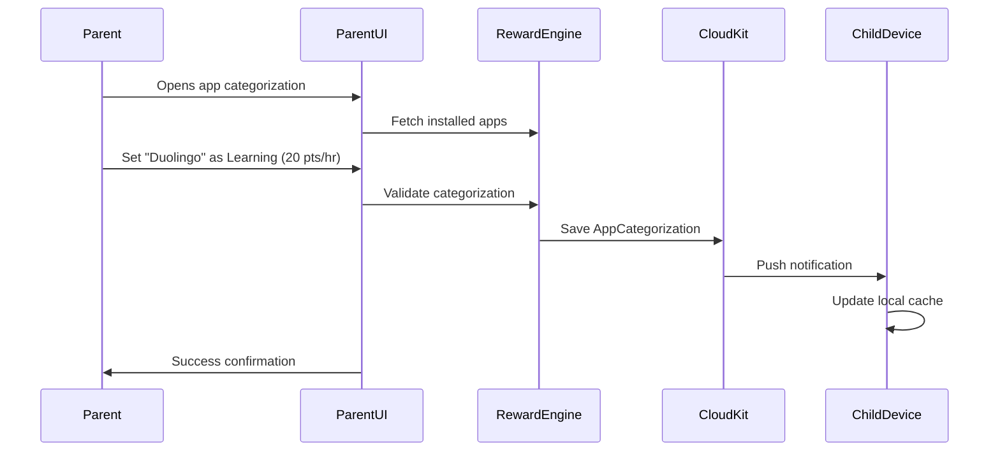
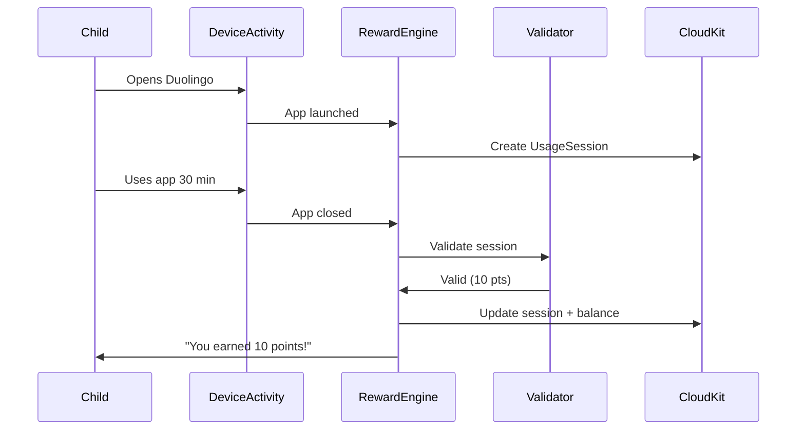
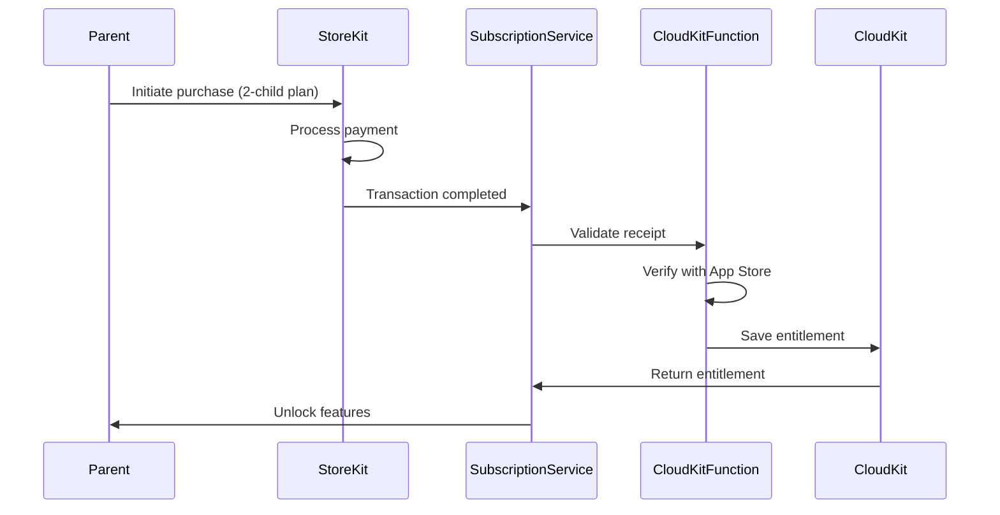
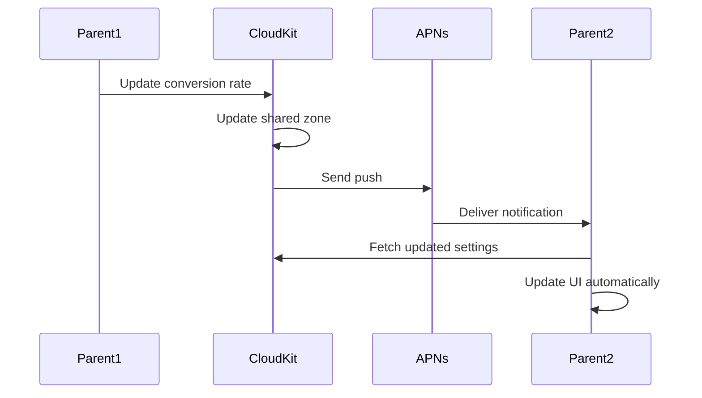

# Core Workflows

## Workflow 1: Parent Categorizes App as Learning

## Workflow 2: Child Earns Points

## Workflow 3: Subscription Purchase & Feature Gating

## Workflow 4: Multi-Parent Real-Time Sync

---
