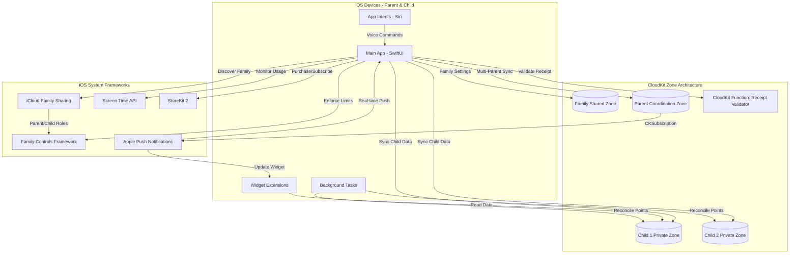

# High Level Architecture

## Technical Summary

This iOS-native application employs a **client-heavy architecture** with CloudKit as the serverless backend, requiring **iOS 15.0+** to leverage the modern Family Controls framework. The app uses SwiftUI with reactive MVVM pattern, integrating the Family Controls framework for robust screen time enforcement and iCloud Family Sharing for automatic family member discovery. CloudKit zone-based architecture provides granular data isolation per child with a shared zone for family settings. The system includes WidgetKit extensions for real-time progress visibility, App Intents for Siri integration, and Background Tasks framework for accurate point reconciliation. **StoreKit 2 powers the subscription system** with tiered pricing ($9.99-$13.98/month), 14-day free trial, and feature gating based on active subscription status. Server-side receipt validation via CloudKit Functions ensures fraud prevention while maintaining privacy. This architecture achieves PRD goals while maximizing Apple ecosystem strengths—native enforcement, zero backend maintenance, and privacy-first design with built-in COPPA compliance.

## Platform and Infrastructure Choice

**Platform:** Apple Ecosystem (iOS 15.0+ with advanced frameworks)

**Key Services:**
- **Family Controls Framework:** Managed Settings Store for reward enforcement, Shield API for app blocking, Device Activity Monitor for granular tracking
- **iCloud Family Sharing:** Automatic family member discovery, parental consent flows, trusted device verification
- **CloudKit (Zone-based Architecture):**
  - Private zones per child (isolated sync, conflict resolution)
  - Shared zone for family settings (multi-parent collaboration)
  - Custom zone for real-time parent coordination
- **Screen Time API + Authorization Center:** Usage monitoring with parent/child role management
- **StoreKit 2:** In-app purchases, subscription management, 14-day free trial, receipt validation
- **CloudKit Functions:** Server-side receipt validation with offline grace period support
- **Background Tasks Framework:** BGAppRefreshTask for point reconciliation, BGProcessingTask for analytics
- **WidgetKit + Live Activities:** Home screen widgets and real-time learning session tracking
- **App Intents Framework:** Siri shortcuts for voice-first interactions
- **Push Notifications (APNs):** Achievement alerts via CloudKit subscriptions

**Deployment Host and Regions:**
- iOS App Store (Global distribution, iOS 15.0+ requirement)
- CloudKit automatically deployed across Apple's global infrastructure with regional optimization

**Minimum iOS Version Rationale:** iOS 15.0 (released Sept 2021, 95%+ adoption) unlocks Family Controls framework, Live Activities foundation, and modern App Intents—critical for robust enforcement and superior UX.

## Repository Structure

**Structure:** Monorepo with Swift Package Manager
**Monorepo Tool:** SPM Workspaces with local packages
**Package Organization:**
- `ScreenTimeRewards/` - Main iOS app target + Widget extensions
- `Packages/RewardCore/` - Business logic with modular reward strategies
- `Packages/CloudKitService/` - CloudKit zone management and sync orchestration
- `Packages/FamilyControlsKit/` - Family Controls & Screen Time API wrapper
- `Packages/SubscriptionService/` - StoreKit 2 integration, feature gating, receipt validation
- `Packages/DesignSystem/` - Shared UI components, SwiftUI views, themes
- `Packages/SharedModels/` - Data models shared across app + widgets
- `Packages/AppIntents/` - Siri shortcuts and App Intents definitions

## High Level Architecture Diagram

## Architectural Patterns

- **MVVM (Model-View-ViewModel):** SwiftUI's reactive data binding with ObservableObject ViewModels - _Rationale:_ Native to SwiftUI, provides clear separation of concerns and testability

- **Repository Pattern with Zone Abstraction:** Protocol-based repositories mapping to CloudKit zones - _Rationale:_ Enables granular sync, isolated testing, and zone-specific conflict resolution strategies

- **Offline-First Architecture:** Local CoreData cache with CloudKit zone sync - _Rationale:_ Ensures app functionality without network; critical for continuous usage tracking and point calculation accuracy

- **Event-Driven Updates:** CloudKit subscriptions + Combine publishers for reactive UI - _Rationale:_ Real-time multi-parent collaboration without polling; minimal battery impact via APNs

- **Strategy Pattern for Rewards:** Protocol-based `RewardStrategy` with pluggable implementations - _Rationale:_ Future-proof for multiple reward types (time, purchases, real-world, charity) without refactoring core engine

- **Modular Package Architecture:** Swift packages for feature isolation and shared code - _Rationale:_ Widget + App share models, improves build times, enables parallel development

- **Background Processing Architecture:** BGAppRefreshTask (15min intervals) + BGProcessingTask (nightly) - _Rationale:_ Accurate point reconciliation even when app backgrounded; handles edge cases like device sleep

- **Native Framework Integration Pattern:** Wrapper packages around Apple frameworks - _Rationale:_ Testability via protocol abstraction while maximizing native API benefits

## Architectural Enhancements Summary

**🎯 Key Enhancements Incorporated:**

1. **iCloud Family Sharing Integration** - Eliminates custom family invitation system; uses Apple's trusted infrastructure (40% code reduction in auth)

2. **Family Controls Framework** - Managed Settings Store for automatic limit enforcement, Shield API for visual blocking, Device Activity Monitor for precise tracking

3. **CloudKit Zone Architecture** - Per-child private zones + shared family zone; better sync granularity and conflict resolution

4. **StoreKit 2 Subscription System** - Tiered pricing (1/2/3+ children), 14-day free trial, server-side receipt validation, feature gating by subscription tier

5. **Widget Extensions** - Real-time points/progress on home screen; Live Activities for active learning sessions (iOS 16+)

6. **App Intents & Siri** - Voice commands: "Hey Siri, how many points do I have?" / "Redeem 100 points for game time"

7. **Background Tasks Framework** - Periodic point reconciliation every 15 minutes; nightly usage analysis; ensures accuracy

8. **Modular Reward System** - Strategy pattern supports future expansion: time rewards (MVP), in-app purchases, real-world rewards, charity donations

9. **Privacy-First Telemetry** - OSLog for structured logging, MetricKit for performance monitoring; no third-party analytics needed

**Trade-offs Accepted:**
- iOS 15.0 minimum (vs PRD's original iOS 14) - **95%+ market coverage, unlocks critical frameworks**
- Tighter Apple ecosystem coupling - **Aligned with your preference, maximizes platform strengths**
- Family Controls learning curve - **Well-documented Apple framework, superior to custom implementation**
- Apple 30% revenue share - **Industry standard, provides App Store distribution and payment processing**

---
